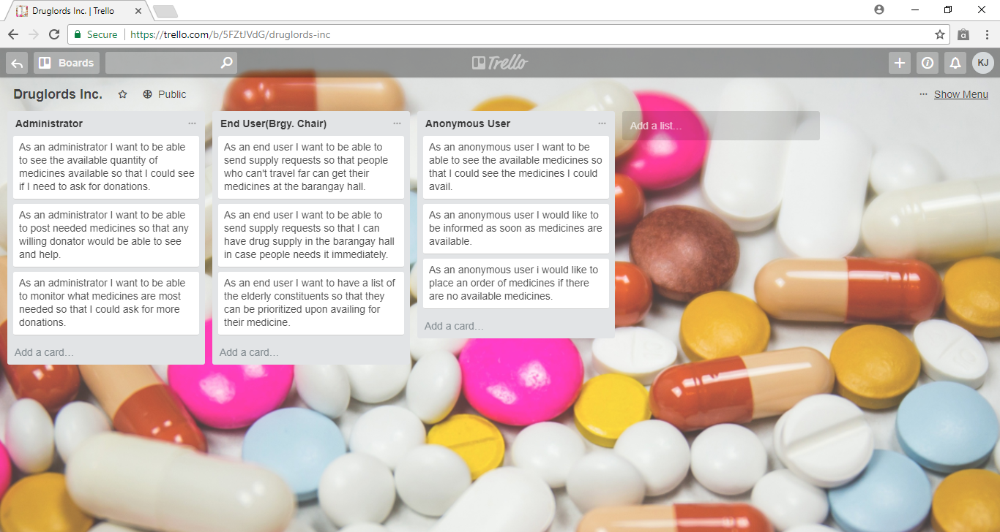
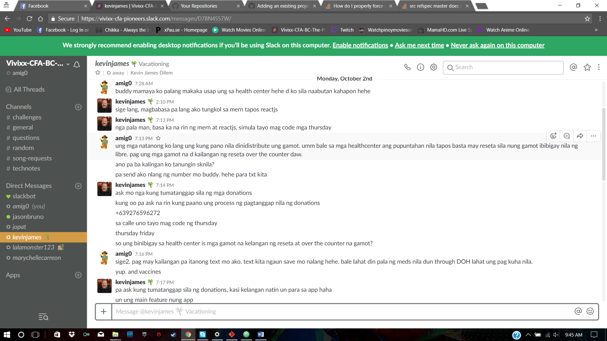
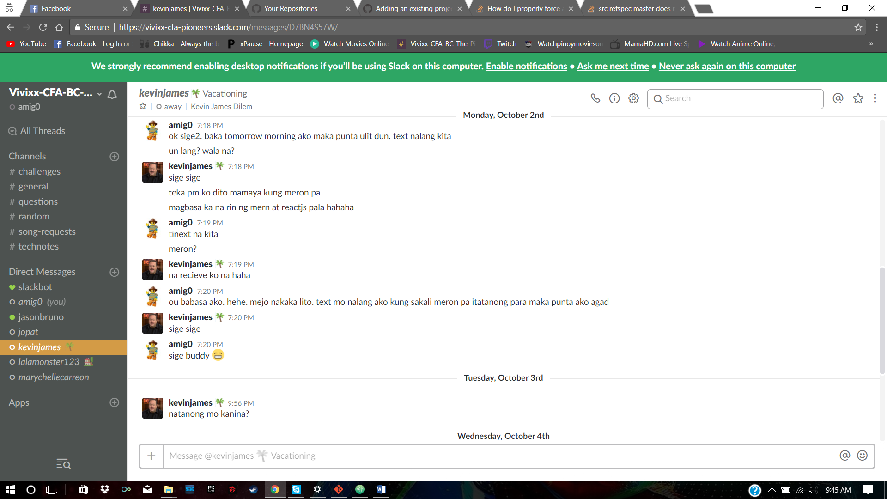
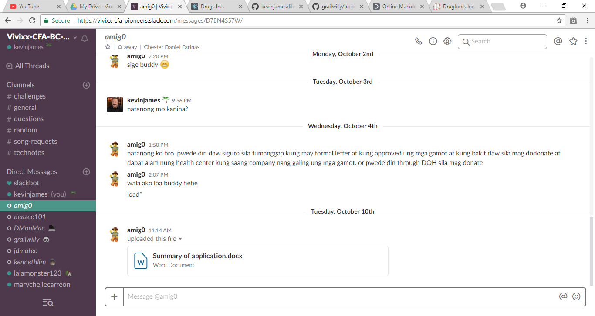
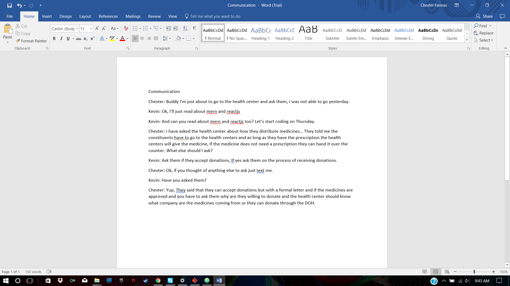

# Drugs Inc. v1.0.0

<p align="center">
	
</p>

## Table of Contents

- [Team](#team)
- [Purpose](#purpose)
- [Problem](#problem)
- [User Stories](#user-stories)
- [Wireframe](#wireframe)
- [Entity Relationship Diagram](#entity-relationship-diagram)
- [Tools and Methodologies](#tools-and-methodologies)
- [Usage](#usage)
- [Demo](#demo)
- [Future Improvements](#future-improvements)


### Team

| Contributor | Github | Portfolio |
| --- | --- | --- |
| Kevin James Dilem | [kevinjamesdilem](https://github.com/kevinjamesdilem) | [kevinjd.github.io](https://kevinjd.github.io/) |
| Chester Daniel Farinas | [cfarinas024](https://github.com/cfarinas024) | [kevinjd.github.io](https://cfarinas024.github.io/) |


### Purpose
 We created an App that helps the constituents of each district acquire medicines at health centers and informs them when a certain medicine is available.

### Problem

The problem affects mostly are the elderly or the disabled constituents that have a hard time getting medicine required because, some people simply can't afford the medicine or they are unable to get to their health centers because of certain ailments.


### User Stories




### Wireframe

[WireFrame](https://drive.google.com/open?id=0B7dqpd2EKN6_emlUVHVWeEhSaGM)

### Entity Relationship Diagram
[ERD](https://drive.google.com/open?id=0B7dqpd2EKN6_bjk2OTdhSnVHQUk)

### Tools and Methodologies
I. Building the App

- [Github](https://github.com/kevinjamesdilem/drugsincapp)
- [Trello](https://trello.com/b/5FZtJVdG/druglords-inc)
- [Google Drive (WireFrame)](https://drive.google.com/open?id=0B7dqpd2EKN6_emlUVHVWeEhSaGM)
- [Google Drive (ERD)](https://drive.google.com/open?id=0B7dqpd2EKN6_bjk2OTdhSnVHQUk)

II. Communication

- Slack <br/>






### Usage

Clone or Download Repo

```
https://github.com/kevinjamesdilem/drugsincapp.git
https://github.com/cfarinas024/drugsincapp.git
```
<br/>

install dependencies

```
$ npm install
```

<br/>

run server

```
$ npm start
```

Visit http://localhost:3000/
Visit http://localhost:3000/

### Future Improvements(to be added)

- Login Module(Functionality)
- Registration Module(Functionality)
- Request Module(Functionality)
- Donate Module(Functionality)
